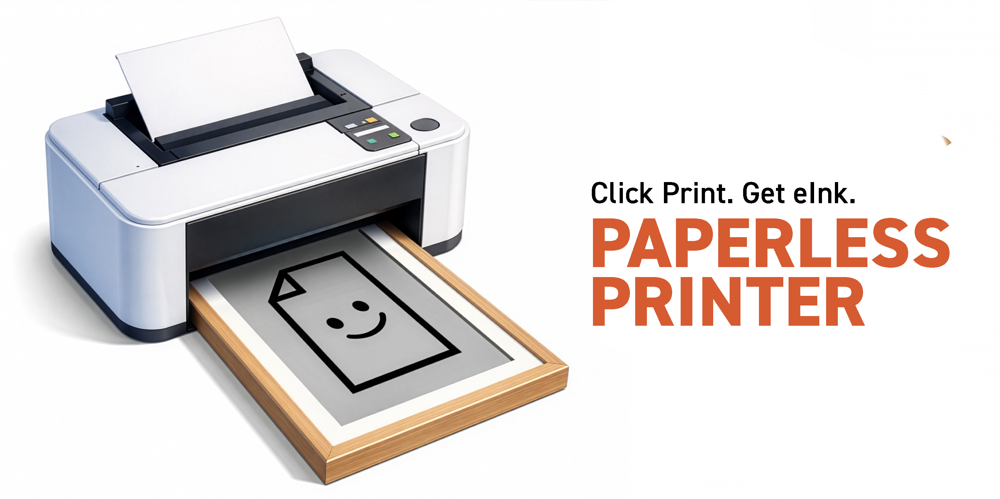

# paperlessprinter



Standalone IPP-over-HTTP server that receives print jobs, converts pages to PNG, and POSTs them to a HTTPS endpoint.

Used in the [paperlesspaper](https://paperlesspaper.de/en), the Open Source eInk picture frame.

## Quick start

```bash
cd /Users/utzel/htdocs/paperlessprinter
python3 -m venv .venv
source .venv/bin/activate
pip install -r requirements.txt

cp .env.example .env
# edit .env

python server.py
```

curl -vk http://127.0.0.1:8631/ipp/print

Server defaults to `http://0.0.0.0:8631/ipp/print`.

## Notes

- This is a **minimal** IPP implementation focused on `Print-Job` payload extraction.
- For internet exposure, run behind a reverse proxy (Caddy/Nginx) for TLS.
- Set `IPP_SHARED_TOKEN` if you want a simple shared-secret header gate.
- The first rendered PNG is also written to `IPP_TEMP_DIR` (default `./temp`).

## macOS setup (printer)

You can add a printer that targets the server:

- System Settings → Printers & Scanners → Add Printer…
- Use IP address / URL:
  - `ipp://<your-host>:8631/ipp/print`

Driver: pick a generic PostScript/PDF-capable driver if prompted.

## Outbound POST format

If `POST_ENDPOINT` is set, the server sends **a single** `multipart/form-data` POST containing **only the first page** rendered as PNG.
If `POST_ENDPOINT` is empty, the server runs in **store-only mode** (no upload).

- optional fields (enabled by default): `job_id`, `request_id`, `page`, `total_pages`, `document_format`, `job_name`, `printer_uri`, `user`
- file: field name configurable via `POST_FILE_FIELD` (default: `file`)

Configured via `.env`:

- `POST_ENDPOINT`
- `POST_AUTH_HEADER` + `POST_AUTH_VALUE`
- `POST_FILE_FIELD`
- `POST_INCLUDE_META_FIELDS`

To enable uploading, set `POST_ENDPOINT` (e.g. `https://api.memo.wirewire.de/print/`).

### paperlesspaper example

To send the rendered PNG to `uploadSingleImage/<paperId>`, you can either:

- set a base endpoint and let the server append `/<paperId>` automatically:
  - `POST_ENDPOINT=
https://api.memo.wirewire.de/v1/papers/uploadSingleImage`
  - `PAPER_ID=<paperId>`

or

- include a placeholder in `POST_ENDPOINT`:
  - `POST_ENDPOINT=
https://api.memo.wirewire.de/v1/papers/uploadSingleImage/<paperId>`
  - `PAPER_ID=<paperId>`

Full example:

- `POST_AUTH_HEADER=x-api-key`
- `POST_AUTH_VALUE=<token>`
- `POST_FILE_FIELD=picture`
- `POST_INCLUDE_META_FIELDS=false`

#### Per-printer overrides via the IPP URL

The server accepts optional per-request overrides for `PAPER_ID` and `POST_AUTH_VALUE` via the `/ipp/print` URL.
This lets you configure different printers (or different macOS printer entries) to upload to different Paper IDs or use different tokens.

- Path segments:
  - `ipp://<your-host>:8631/ipp/print/123` (sets `paper_id=123`)
  - `ipp://<your-host>:8631/ipp/print/123/TOKEN` (sets `paper_id=123`, `auth_value=TOKEN`)
- Query params (not recommended, since MacOS strips these when using as clickable URL):
  - `ipp://<your-host>:8631/ipp/print?paper_id=123&auth_value=TOKEN`

`paper_id` is applied to `POST_ENDPOINT` in two ways:

- If `POST_ENDPOINT` contains one of these placeholders, it is replaced: `<paperId>`, `{PAPER_ID}`, `{paper_id}`.
- Otherwise, if `paper_id` is set, it is appended as the final path segment: `POST_ENDPOINT.rstrip('/') + '/' + paper_id`.

### Quick upload test (no printing)

Uploads the newest PNG from `IPP_TEMP_DIR` (default `./temp`) using the same `POST_*` settings:

```bash
python tools/upload_latest_png.py
```

## Fly.io deployment

This repo includes a `Dockerfile` and `fly.toml` suitable for running on [Fly.io](https://fly.io).

1. Install flyctl and log in:

```bash
brew install flyctl
fly auth login
```

2. Create the app (you can let Fly pick a name):

```bash
fly launch
```

3. Configure secrets/env (examples):

```bash
fly secrets set \
  POST_ENDPOINT='https://example.com/print/' \
  POST_AUTH_HEADER='x-api-key' \
  POST_AUTH_VALUE='TOKEN'

# Optional: shared-secret for inbound print jobs
fly secrets set IPP_SHARED_TOKEN='SOME_SHARED_TOKEN'
```

4. Deploy:

```bash
fly deploy
```

### macOS printer URL

Use an IPPS URL (TLS terminates at Fly):

- `ipps://<your-app>.fly.dev/ipp/print`

If you use `IPP_SHARED_TOKEN`, configure your client to send `X-IPP-Token`.
