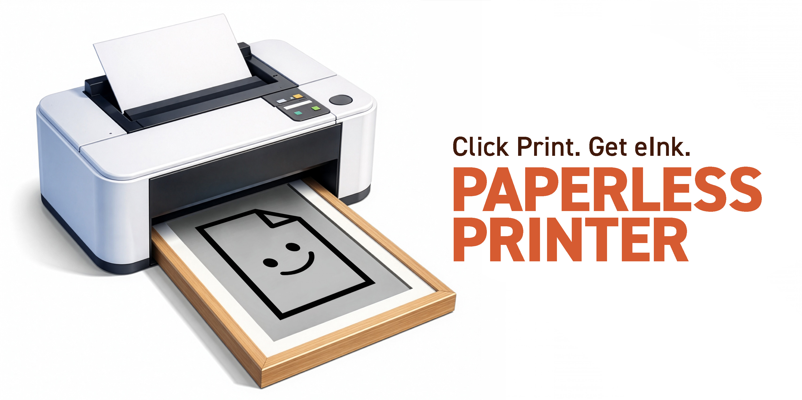
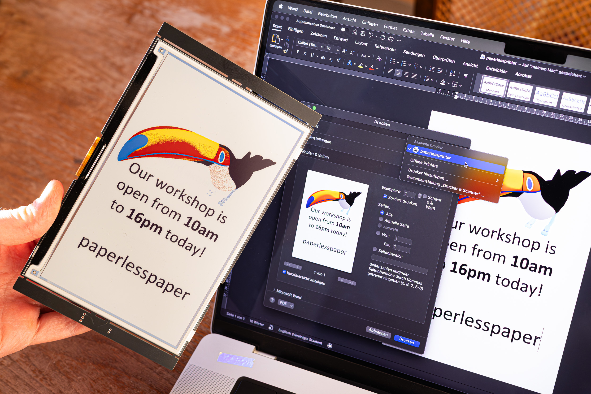
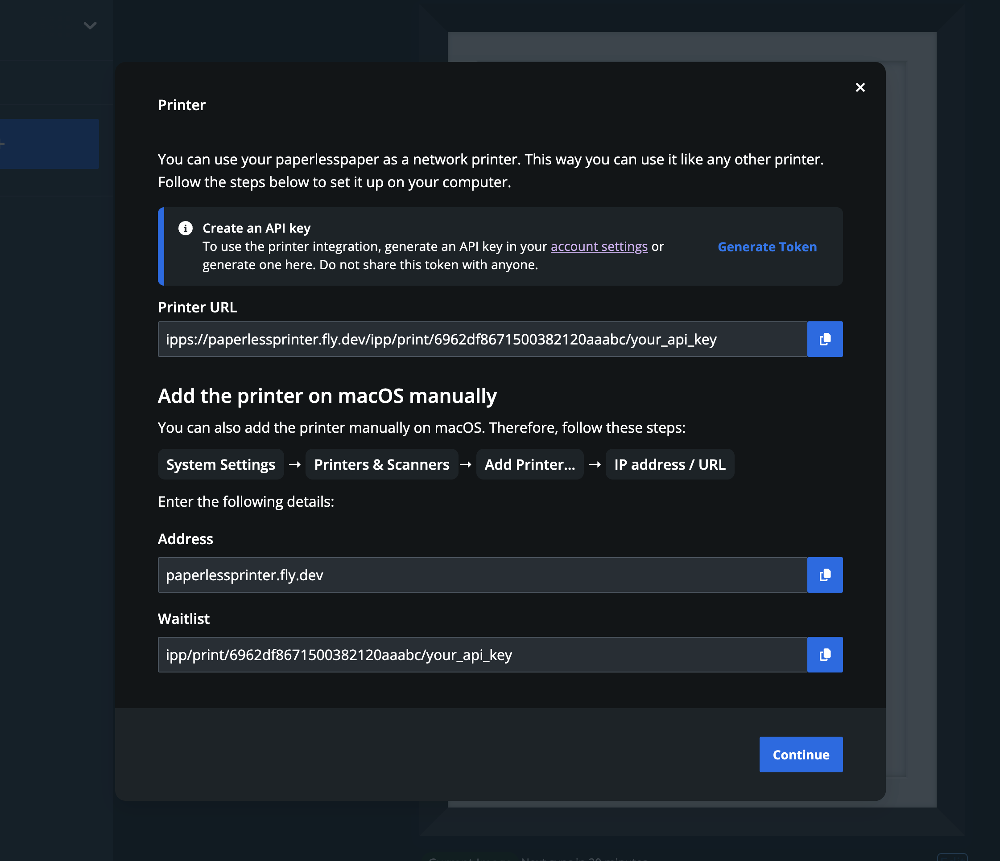
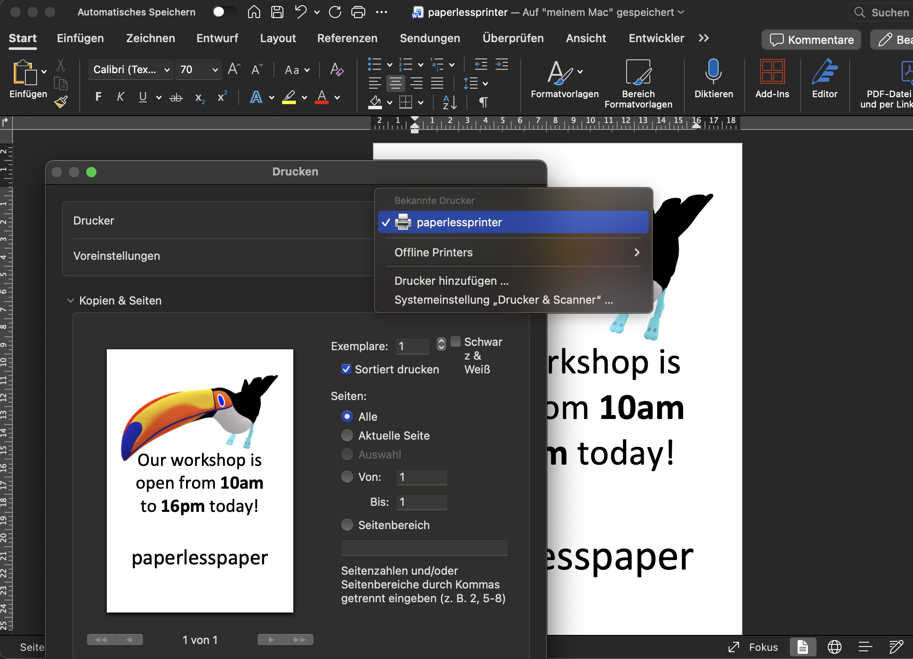
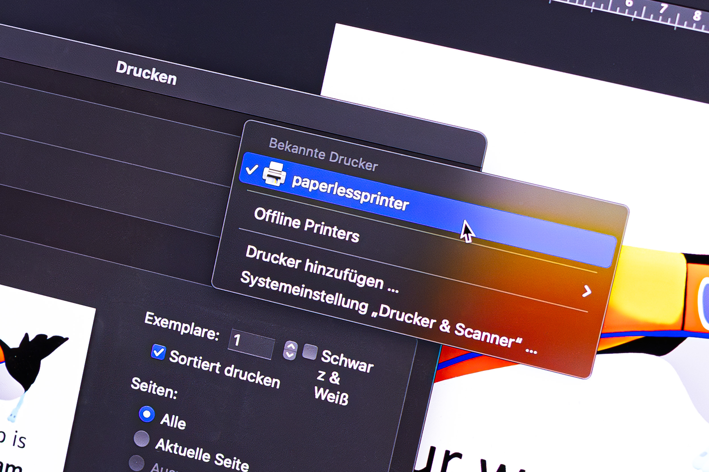

# paperlessprinter



Standalone _IPP-over-HTTP_ server that receives print jobs, converts pages to PNG, and POSTs them to a HTTPS endpoint.

This lets you use your ePaper device like a regular printer and allows printing from anywhere.

Used in [paperlesspaper](https://paperlesspaper.de/en), the Open Source eInk picture frame.



## Quick start

```bash
cd /path/to/paperlesspaper-print
python3 -m venv .venv
source .venv/bin/activate
pip install -r requirements.txt

# Optional for a native install. The Docker image already includes both.
brew install ghostscript cups-filters

cp .env.example .env
# edit .env

python server.py
```

curl -vk http://127.0.0.1:8631/ipp/print

Server defaults to `http://0.0.0.0:8631/ipp/print`.

## Notes

- The server advertises IPP 1.1/2.0 driverless capabilities and supports the operations used by macOS, the Microsoft IPP Class Driver, and CUPS.
- PDF and JPEG jobs work out of the box. PWG Raster requires CUPS filters and PostScript requires Ghostscript; both are included in the Docker image.
- For internet exposure, run behind a reverse proxy (Caddy/Nginx) for TLS.
- If clients send `Expect: 100-continue`, keep `IPP_SEND_EXPECT_CONTINUE=false` unless you have verified your proxy path handles an origin-generated `100 Continue` correctly.
- Set `IPP_SHARED_TOKEN` if you want a simple shared-secret header gate.
- The first rendered PNG is also written to `IPP_TEMP_DIR` (default `./temp`).
- Optional auto-restart on crash:
  - `AUTO_RESTART=true`
  - `AUTO_RESTART_DELAY_SECONDS=2`
  - `AUTO_RESTART_MAX=0` (0 = unlimited)

## Printer setup

Always use the complete per-printer URL when one is supplied. CUPS and macOS use
the IPP service URI form:

```text
ipps://print.example/ipp/print/<paper-id>/<token>
```

Windows directed discovery uses the HTTPS transport form of the same endpoint:

```text
https://print.example/ipp/print/<paper-id>/<token>
```

The token is a credential. Do not paste it into public logs or screenshots. The server redacts it from new request-path log entries.

### Windows 11

Deploy the current Docker image first. Windows caches failed capability discovery, so remove any queue that is stuck at **Druckerdaten werden abgerufen...** before adding it again.

In an elevated PowerShell window:

```powershell
Get-Printer -Name "paperlesspaper" -ErrorAction SilentlyContinue | Remove-Printer
Restart-Service Spooler
Add-Printer -Name "paperlesspaper" -IppURL "https://print.example/ipp/print/<paper-id>/<token>"
Get-Printer -Name "paperlesspaper" | Format-List Name,DriverName,PortName,PrinterStatus
```

The driver should be **Microsoft IPP Class Driver**. A generated `WSD-...` port
name is normal for Windows directed discovery. You can also use **Settings →
Bluetooth & devices → Printers & scanners → Add device → Add manually**, choose
an IPP printer, and enter the same full HTTPS URL. `Add-Printer -IppURL` rejects
the `ipps://` form before contacting the server on affected Windows versions.

For Windows-side diagnostics, enable and inspect the print service event log:

```powershell
wevtutil sl Microsoft-Windows-PrintService/Operational /e:true
Get-WinEvent -LogName Microsoft-Windows-PrintService/Operational -MaxEvents 100 |
  Format-List TimeCreated,Id,LevelDisplayName,Message
```

### Linux (CUPS)

Install CUPS client tools, then create a driverless IPP Everywhere queue:

```bash
sudo lpadmin -p paperlesspaper -E \
  -v 'ipps://print.example/ipp/print/<paper-id>/<token>' \
  -m everywhere
lpstat -p paperlesspaper -l
lp -d paperlesspaper document.pdf
```

For troubleshooting, `ipptool` can query the same endpoint directly:

```bash
ipptool -tv \
  'ipps://print.example/ipp/print/<paper-id>/<token>' \
  /usr/share/cups/ipptool/get-printer-attributes.test
```

### macOS

You can add a printer that targets the server:

- System Settings → Printers & Scanners → Add Printer…
- Use IP address / URL:
  - `ipps://print.example/ipp/print/<paper-id>/<token>`

Driver: prefer AirPrint or a generic IPP/PDF-capable driver if prompted.

If you use a Generic PostScript / plain IPP driver on macOS, install Ghostscript on the server host so PostScript jobs can be rendered directly to PNG. AirPrint/PDF-capable queues do not need that extra dependency.

## Outbound POST format

If `POST_ENDPOINT` is set, the server sends **a single** `multipart/form-data` POST containing **only the first page** rendered as PNG by default.
If `POST_SEND_ALL_PAGES=true`, it instead sends **one multipart/form-data POST containing all rendered pages**, in page order.
If `POST_ENDPOINT` is empty, the server runs in **store-only mode** (no upload).

- optional fields (disabled by default): `job_id`, `request_id`, `total_pages`, `document_format`, `job_name`, `printer_uri`, `user`
- optional field for single-page uploads: `page`
- file: field name configurable via `POST_FILE_FIELD` (default: `file`); with `POST_SEND_ALL_PAGES=true`, the multipart body repeats that same file field once per page

Configured via `.env`:

- `IPP_SEND_EXPECT_CONTINUE`
- `POST_ENDPOINT`
- `POST_AUTH_HEADER` + `POST_AUTH_VALUE`
- `POST_FILE_FIELD`
- `POST_INCLUDE_META_FIELDS`
- `POST_SEND_ALL_PAGES`

To enable uploading, set `POST_ENDPOINT` (e.g. `https://api.memo.wirewire.de/print/`).

### paperlesspaper example

To send the rendered PNG to `uploadSingleImage/<paperId>`, you can either:

- set a base endpoint and let the server append `/<paperId>` automatically:
  - `POST_ENDPOINT=
https://api.memo.wirewire.de/v1/papers/uploadSingleImage`
  - `PAPER_ID=<paperId>`

or

- include a placeholder in `POST_ENDPOINT`:
  - `POST_ENDPOINT=
https://api.memo.wirewire.de/v1/papers/uploadSingleImage/<paperId>`
  - `PAPER_ID=<paperId>`

Full example:

- `POST_AUTH_HEADER=x-api-key`
- `POST_AUTH_VALUE=<token>`
- `POST_FILE_FIELD=picture`
- `POST_INCLUDE_META_FIELDS=false`
- `POST_SEND_ALL_PAGES=false`



#### Per-printer overrides via the IPP URL

The server accepts optional per-request overrides for `PAPER_ID` and `POST_AUTH_VALUE` via the `/ipp/print` URL.
This lets you configure different printers (or different printer entries) to upload to different Paper IDs or use different tokens.
It also recovers those values from the IPP `printer-uri` attribute when a client or reverse proxy sends the HTTP request to the base `/ipp/print` path.

- Path segments:
  - `ipp://<your-host>:8631/ipp/print/123` (sets `paper_id=123`)
  - `ipp://<your-host>:8631/ipp/print/123/TOKEN` (sets `paper_id=123`, `auth_value=TOKEN`)
- Query params (not recommended, since MacOS strips these when using as clickable URL):
  - `ipp://<your-host>:8631/ipp/print?paper_id=123&auth_value=TOKEN`

`paper_id` is applied to `POST_ENDPOINT` in two ways:

- If `POST_ENDPOINT` contains one of these placeholders, it is replaced: `<paperId>`, `{PAPER_ID}`, `{paper_id}`.
- Otherwise, if `paper_id` is set, it is appended as the final path segment: `POST_ENDPOINT.rstrip('/') + '/' + paper_id`.

#### Exact output sizes per device

The server always advertises these two selectable device sizes during IPP
discovery:

- **Open Paper L (13.3 inch)** — 1200×1600 pixels
- **Open Paper L (13.3 inch) – Randlos** — 1200×1600 pixels, zero margins
- **OpenPaper 7 (7.3 inch)** — 480×800 pixels
- **OpenPaper 7 (7.3 inch) – Randlos** — 480×800 pixels, zero margins

The normal variants advertise a 3 mm layout margin. The borderless variants
advertise zero margins on all four sides and use a `.borderless` media name so
CUPS/macOS can group them with their named base size.

When a client submits `media` or `media-col`, the selected entry controls the
exact output canvas. The server also preserves the selection across the
Create-Job/Send-Document workflow used by macOS and some Windows clients.

`IPP_TARGET_PROFILES` is optional. It can set the default size and fitting
options for a paper ID while both built-in device sizes remain selectable:

```env
IPP_RENDER_DPI=150
IPP_TARGET_PROFILES={"paper-id-one":{"width":1200,"height":1600,"fit":"contain"},"paper-id-two":{"width":480,"height":800,"fit":"contain","auto_rotate":true,"background":"#ffffff"}}
```

Profile options:

- `width` and `height` are required positive pixel dimensions.
- `fit=contain` is the default and preserves the complete page, adding the configured background where needed.
- `fit=cover` fills the display and center-crops overflow.
- `fit=stretch` fills the display without cropping but can distort the page.
- `auto_rotate=true` is the default and rotates portrait/landscape content when that is a better match for the target.
- `background=#ffffff` is the default padding color for `contain`.
- A profile keyed by `"*"` is used as an optional fallback when no exact paper ID matches.

At 150 dpi, Open Paper L is advertised as approximately 203.20×270.93 mm and
OpenPaper 7 as approximately 81.28×135.47 mm. This makes a driverless client
generate the intended raster dimensions; final server-side normalization still
guarantees the exact selected pixel size.

Windows, macOS, and CUPS cache printer capabilities. Remove and re-add an existing printer after changing its profile so the print dialog receives the new custom media size.

### Quick upload test (no printing)

Uploads the newest PNG from `IPP_TEMP_DIR` (default `./temp`) using the same `POST_*` settings:

```bash
python tools/upload_latest_png.py
```



## Fly.io deployment

This repo includes a `Dockerfile` and `fly.toml` suitable for running on [Fly.io](https://fly.io).

1. Install flyctl and log in:

```bash
brew install flyctl
fly auth login
```

2. Create the app (you can let Fly pick a name):

```bash
fly launch
```

3. Configure secrets/env (examples):

```bash
fly secrets set \
  POST_ENDPOINT='https://example.com/print/' \
  POST_AUTH_HEADER='x-api-key' \
  POST_AUTH_VALUE='TOKEN'

# Optional: shared-secret for inbound print jobs
fly secrets set IPP_SHARED_TOKEN='SOME_SHARED_TOKEN'
```

4. Deploy:

```bash
fly deploy
```



### Printer URL

Use an IPPS URL (TLS terminates at Fly):

- `ipps://<your-app>.fly.dev/ipp/print`

If you use `IPP_SHARED_TOKEN`, configure your client to send `X-IPP-Token`.

## License

AGPL-3.0. See [LICENSE](./LICENSE).
